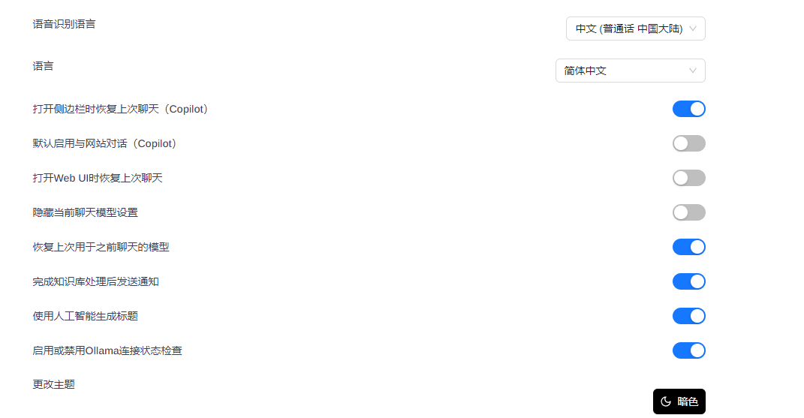

# 本地部署deepseek，包含解决网络连接，ollama下载慢的问题
## 概述

DeepSeek 是一款开源的大语言模型，凭借其先进的算法架构，为 AI 对话交互带来了革新性的体验。通过本地部署，可以自由选择是否要使用网络，直接接入jetbrain旗下的软件中。

这里将完整介绍ollama下载，LM Studio下载，网络连接问题以及ollama直接下载过慢的问题。

## 前置准备

**硬件环境：**

- CPU >= 2 Core
- 显存/RAM ≥ 16 GiB（推荐）
- 以上是最低标准
- 附：本人使用的是14700kf， 3060 12g 以及32g内存，使用的是32b q4模型

## 开始部署

### 1. 安装 Ollama

[Ollama](https://ollama.com/) 是一款跨平台的大模型管理客户端（MacOS、Windows、Linux），旨在无缝部署大型语言模型 (LLM)，例如 DeepSeek、Llama、Mistral 等。Ollama 提供大模型一键部署，所有使用数据均会保存在本地机器内，提供全方面的数据隐私和安全性。

访问 [Ollama 官网](https://ollama.com/)，根据提示下载并安装 Ollama 客户端。安装完成后，在终端内运行 `ollama -v` 命令将输出版本号。

点击下载


如果是windows就继续按下载（本人是windows，接下来以下都为windows操作）


下载过程省略，基本全是默认的。完成后（默认应该会自己运行）见到自己电脑右下角隐藏图标里的羊驼说明运行成功


### 2. 介绍通用的ollama下载deepseek（下载稍微大的蒸馏文件时间就会很长）

查询


选择版本，根据自己电脑选择，建议第一次选择7b，后面有调整的。


将代码在终端中运行

```bash
➜  ollama run deepseek-r1:32b
```
经过很长时间成功后，用一下图片验证


如果有就安装成功了，可以继续输入指令聊天，或者使用chatbox连接，这里将不再赘述，将使用其他方法。

### 3. 下载太慢问题解决

我是从LM Studio中下载后的文件进行格式转换到Ollama包下

同样也可以下载使用[hugging face]（https://huggingface.co/deepseek-ai/DeepSeek-R1）挑选需要的版本。

或者就是我本人是使用[LM Studio](https://lmstudio.ai/)


进行默认下载操作（可以按自己的该路径）

下载完成后来到下载完文件的路径，可以看到gguf文件


进入该文件终端中（直接在上方文件路径处将路径改为cmd并enter）
```bash
➜  ollama create DeepSeek-R1-Distill-Qwen-32B-abliterated-Q4_0 -f ./modelfile
```





附上


